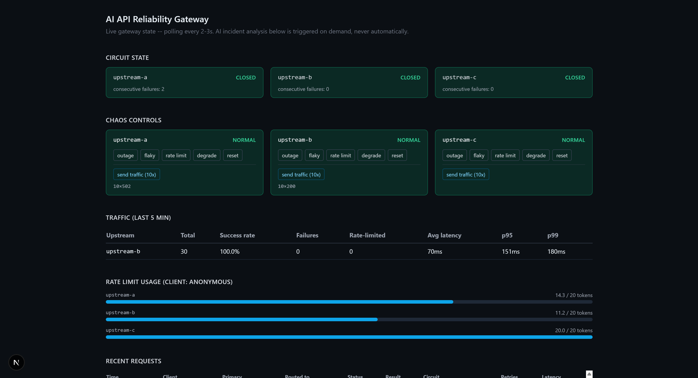
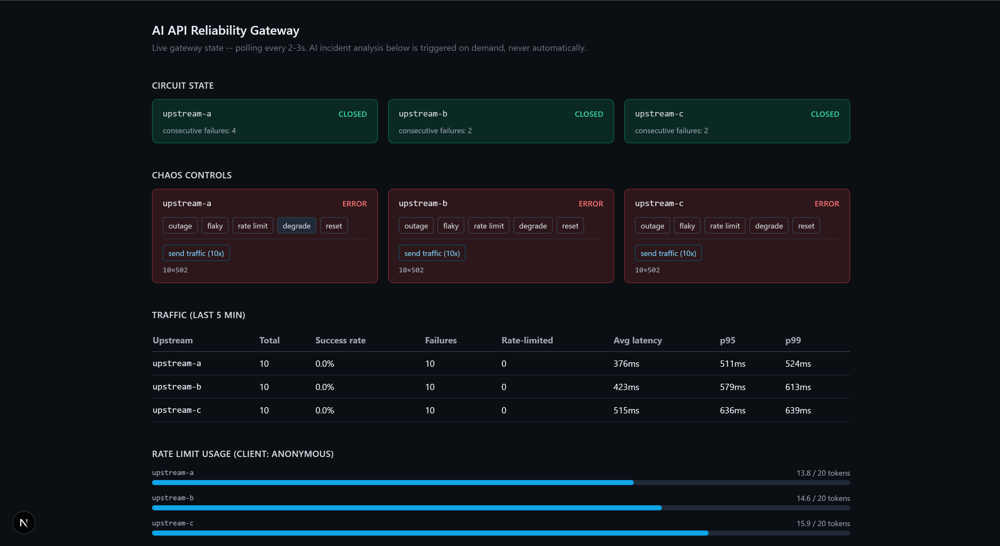

# AI API Reliability Gateway

A backend service that sits between a client and multiple external APIs and
keeps traffic flowing when those APIs degrade or fail, using rate limiting,
retries, circuit breaking, and (in a later phase) AI-assisted failure
analysis kept strictly out of the request path.

This is a portfolio project built in phases. **The core gateway is built and
benchmarked against a naive passthrough before any AI is introduced** — the
AI layer has to prove it earns its place with numbers, not just exist.

## Screenshots

<!--
  Drop screenshots into docs/images/ and they'll render here automatically.
  Suggested shots: the full dashboard, the chaos controls mid-demo (e.g.
  upstream-a in "error" mode with a circuit OPEN), and an AI incident
  report card with a circuit-breaker suggestion.
-->





## How to use the dashboard

Open the dashboard (`http://localhost:3000` locally, or your deployed URL)
and you'll see live gateway state polling every 2-3s, plus two interactive
sections for driving a demo end to end without touching a terminal:

1. **Chaos controls** — one card per upstream (`upstream-a/b/c`). Click a
   scenario button to make that upstream misbehave:
   - `outage` — every request fails (500)
   - `flaky` — a random fraction of requests fail
   - `rate limit` — every request returns 429
   - `degrade` — latency ramps up over ~30s
   - `reset` — back to healthy
2. **Send traffic** — click "send traffic (10x)" under an upstream to fire
   10 real requests through the gateway's `/proxy` path. Watch the Circuit
   state and Recent requests sections update live as the breaker reacts.
3. **AI incident analysis** — once you've generated some failure traffic,
   click "analyze" under that upstream. This sends the last few minutes of
   telemetry to a free LLM (Groq), which classifies the failure pattern
   (outage / degradation / rate limiting / transient blip / healthy),
   writes a plain-English summary, and optionally suggests a new circuit
   breaker threshold — which you can accept with the "apply" button.

A full demo loop: **outage → send traffic → analyze → reset**, all clicks,
no curl required.

## Architecture (Phase 1)

```
client -> gateway (FastAPI) -> mock upstream A/B/C (FastAPI)
              |
              +-- Redis (rate limiter token buckets, circuit breaker state)
```

Each mock upstream is the *same* image, run three times with a different
`UPSTREAM_NAME`. Each instance holds an in-memory "mode" (normal / slow /
error / rate_limited / flaky) that's settable at runtime via `POST /control`
— this is what the Phase 2 chaos layer will drive.

The gateway's request path for `POST /proxy/{primary}`:

1. **Rate limit check** — token bucket per `(client_id, upstream)`, enforced
   atomically in Redis via a Lua script.
2. **Routing/failover** — if the primary upstream's circuit is OPEN, and
   fallback upstreams were given, pick the first fallback whose circuit
   isn't OPEN.
3. **Retry with backoff** — up to `GATEWAY_RETRY_MAX_ATTEMPTS` attempts, only
   for retryable outcomes (5xx, 429, timeouts/connection errors), with full
   jitter exponential backoff.
4. **Circuit breaker update** — the chosen upstream's breaker records the
   final outcome (success/failure) and its state (closed/open/half-open) is
   persisted back to Redis.

### Design decisions worth discussing in an interview

- **Circuit breaker is a pure, dependency-free state machine**
  (`gateway/app/core/circuit_breaker.py`), separate from its Redis
  persistence (`circuit_breaker_store.py`). No I/O, no async, injectable
  clock — trivial to unit test exhaustively (see
  `gateway/tests/test_circuit_breaker.py`, 18 tests covering every
  transition and boundary condition). This separation is the same pattern
  as "functional core, imperative shell."

- **Consecutive-failure counting**, not a rolling error-rate window, trips
  the breaker. Simpler to reason about and test deterministically; the
  tradeoff (less statistically robust under bursty low-traffic patterns) is
  acceptable for this project's scale and is a deliberate, documented
  choice — see the docstring in `circuit_breaker.py`.

- **Half-open behavior**: a configurable number of consecutive successes
  (`half_open_max_calls`) closes the breaker; a single failure during
  half-open reopens it and resets the recovery timer. This avoids
  prematurely trusting a half-recovered upstream.

- **Rate limiter uses a Lua script for atomicity; the circuit breaker store
  does a plain read-modify-write.** This is a deliberate contrast: rate
  limiting is checked on every request from potentially-concurrent clients,
  so a lost update would silently let traffic over budget — worth paying for
  atomicity. A lost update on the circuit breaker just delays a trip by one
  failure count under concurrent load on a single gateway instance, an
  acceptable tradeoff for a project run as a single gateway process. See
  the docstrings in `rate_limiter.py` and `circuit_breaker_store.py`.

- **Retry uses full jitter**, not fixed exponential backoff, to avoid retry
  storms where many clients that failed simultaneously all retry in
  lockstep. Only retryable outcomes (5xx, 429, connection/timeout errors)
  are retried — a malformed-request 4xx would just fail identically again.

- **Router is failover, not load-balancing.** It always prefers the primary
  upstream and only diverts to fallbacks when the primary's circuit is
  OPEN. This matches the project's goal (stay available during degradation)
  rather than optimizing steady-state throughput.

- **Bug caught in manual testing, worth knowing about**: the router
  originally filtered candidate upstreams using a *snapshot* of circuit
  state (`dict[str, CircuitState]`) rather than calling `allow_request()`
  on the actual breaker objects. Since `allow_request()` is the only thing
  that performs the time-based OPEN → HALF_OPEN transition, a primary that
  had genuinely recovered was permanently filtered out before it ever got
  the chance to transition — it could never close again. Caught by actually
  exercising the running docker-compose stack (trip a breaker, wait out the
  timeout, confirm it recovers), not by unit tests alone, since the original
  router unit tests only checked the OPEN/CLOSED snapshot logic in
  isolation and never exercised the interaction with time. Fixed by having
  the router operate on the breaker objects directly and call
  `allow_request()` itself; a regression test now covers exactly this case
  (`test_regression_recovered_primary_is_chosen_again_via_half_open` in
  `gateway/tests/test_router.py`). Worth mentioning in an interview as an
  example of why "unit tests pass" and "the system behaves correctly under
  real time-based state transitions" are different claims.

## Architecture (Phase 2)

```
client -> gateway (FastAPI) -> mock upstream A/B/C (FastAPI)
              |         |
              |         +-- Redis (rate limiter, circuit breaker state)
              |         +-- Postgres (gateway_events, circuit_state_changes)
              |
      operator/benchmark -> POST /chaos/{upstream}/{scenario} -> upstream /control
              |
      dashboard (Next.js, :3000) -- polls gateway's read endpoints every 2-3s
```

### Chaos control API

Drives the mock upstreams' `/control` endpoint to simulate failure
scenarios on demand, without touching the gateway itself:

| Endpoint | Scenario |
|---|---|
| `POST /chaos/{upstream}/outage` | Upstream returns 500 for everything |
| `POST /chaos/{upstream}/intermittent?failure_rate=0.3` | Upstream fails a fraction of requests |
| `POST /chaos/{upstream}/rate_limit_storm` | Upstream returns 429 for everything |
| `POST /chaos/{upstream}/degrade?start_ms=50&end_ms=3000&duration_seconds=30&steps=10` | Latency ramps linearly over time |
| `POST /chaos/{upstream}/reset` | Back to normal mode |
| `POST /chaos/reset_all` | Reset every upstream |
| `GET /chaos/status` | Current mode of every upstream |

`degrade` is the only scenario that's a *trajectory* rather than a single
state flip, so it's implemented as a background asyncio task that owns its
own step/sleep loop (`gateway/app/core/chaos.py`); calling `reset` or
starting a new scenario on that upstream cancels any in-flight degrade
task.

### Structured event logging

Every `/proxy` call writes one row to Postgres's `gateway_events` table —
client id, primary + routed-to upstream, the full retry attempt sequence
(JSONB), final status code, success/failure, rate-limit/circuit-open
flags, circuit state before and after, and latency. Circuit breaker state
*transitions* (not just point-in-time state) are logged separately to
`circuit_state_changes` so the dashboard and, later, the AI layer can see
exactly when and why a breaker flipped.

Logging is fired via `asyncio.create_task(...)` rather than awaited inline,
and every write is wrapped in a try/except that logs-and-swallows
(`gateway/app/core/event_log.py`) — a slow or unavailable Postgres must
never add latency to, or fail, the request it's describing. This is the
same "observability can't become a new failure mode" principle applied at
two layers: fire-and-forget scheduling, and defensive error handling
underneath it.

Schema is created with `CREATE TABLE IF NOT EXISTS` at gateway startup
(`gateway/app/db.py`) rather than a migration framework — a reasonable
simplification for one append-mostly schema in a portfolio project.

### Dashboard

A minimal Next.js + TypeScript + Tailwind app (`dashboard/`) that polls the
gateway's read endpoints (no websockets — four cheap GET endpoints polled
every 2-3s is simple and sufficient at this scale) and shows:

- Circuit breaker state per upstream (closed/open/half-open, color-coded)
- Success/failure rate, rate-limited count, and p95/p99 latency per
  upstream over a rolling window (`GET /stats/summary`)
- Rate limit token bucket usage per upstream (`GET /ratelimit/{client}/{upstream}`)
- A live feed of recent requests with routing/retry/circuit detail
  (`GET /events/recent`)

## Benchmarks (Phase 3)

[`BENCHMARK_REPORT.md`](BENCHMARK_REPORT.md) is the generated deliverable: 5
scenarios (the 4 required -- total outage, intermittent failure, rate-limit
storm, gradual latency degradation -- plus a bonus outage-with-failover run),
each run twice (naive direct-to-upstream vs. through the gateway), comparing
availability, error rate, and p50/p95/p99 latency.

**This is not a smart-always-wins report.** The intermittent-failure and
failover scenarios show large, real availability gains (+35pp and +75pp).
The total-outage and rate-limit-storm scenarios show the smart gateway
cannot manufacture availability that fundamentally is not there -- its
value there is failing fast instead of hammering a dead upstream. The
gradual-degradation scenario shows the smart gateway actually doing *worse*
than naive: a fixed per-attempt timeout plus retries can turn a
slow-but-eventually-successful upstream into outright failures, a real
limitation of an error-only (not latency-aware) circuit breaker. All three
outcomes are documented with the actual numbers and the reasoning behind
them -- see the report for the full breakdown.

To reproduce it (with the stack up via `docker compose up -d`):

```bash
cd benchmark
python -m venv .venv
.venv/Scripts/python -m pip install -r requirements.txt   # Windows
# .venv/bin/python -m pip install -r requirements.txt     # macOS/Linux
.venv/Scripts/python run_benchmark.py
```

Takes several minutes end to end -- the degradation scenario deliberately
pushes latency past the gateway's timeout so retries and circuit-breaker
behavior actually get exercised, which is also what makes that scenario
slow to run. The script resets all gateway state (circuit breaker + rate
limiter) and re-establishes an identical failure condition (same chaos
mode, same RNG seed where relevant) before each of the two runs per
scenario, so the naive and smart runs are a fair, reproducible comparison
rather than two independently-noisy samples.

## Running locally

Requires Docker Desktop.

```bash
docker compose up -d --build
```

This starts: `redis`, `postgres`, `upstream-a`, `upstream-b`, `upstream-c`
(ports 9001-9003), `gateway` (port 8080), and `dashboard` (port 3000 —
open http://localhost:3000).

### Try it

```bash
# Normal request through the gateway
curl http://localhost:8080/proxy/upstream-a -X POST

# Make upstream-a start failing, watch the breaker trip after 5 consecutive
# failures (GATEWAY_CB_FAILURE_THRESHOLD default), then verify /proxy fails
# fast (no upstream call) once it is open:
curl http://localhost:9001/control -X POST -H "Content-Type: application/json" -d "{\"mode\": \"error\"}"
for i in 1 2 3 4 5 6; do curl -s http://localhost:8080/proxy/upstream-a -X POST | head -c 200; echo; done
curl http://localhost:8080/circuit/upstream-a

# Restore it, wait out the recovery timeout, watch it go half-open then closed:
curl http://localhost:9001/control -X POST -H "Content-Type: application/json" -d "{\"mode\": \"normal\"}"
sleep 11
curl http://localhost:8080/proxy/upstream-a -X POST
curl http://localhost:8080/circuit/upstream-a

# Failover: trip upstream-a's breaker, then send with a fallback
curl "http://localhost:8080/proxy/upstream-a?fallbacks=upstream-b" -X POST

# Rate limit status
curl http://localhost:8080/ratelimit/anonymous/upstream-a

# Chaos: trigger an outage on upstream-b, watch it in the dashboard or via:
curl -X POST http://localhost:8080/chaos/upstream-b/outage
curl http://localhost:8080/chaos/status
curl -X POST http://localhost:8080/chaos/upstream-b/reset

# Recent event log / aggregated stats (what the dashboard polls)
curl "http://localhost:8080/events/recent?limit=10"
curl "http://localhost:8080/stats/summary?window_seconds=300"
```

### Running gateway unit tests locally (without Docker)

The circuit breaker tests have zero external dependencies (no FastAPI,
Redis, etc.), so they can run directly:

```bash
cd gateway
python -m venv .venv
.venv/Scripts/python -m pip install pytest pytest-asyncio   # Windows
# .venv/bin/python -m pip install pytest pytest-asyncio     # macOS/Linux
.venv/Scripts/python -m pytest tests/test_circuit_breaker.py -v
```

Note: the full `requirements.txt` (fastapi/pydantic/asyncpg, which have
compiled Rust extensions) may fail to build a wheel on very new Python
versions not yet supported by their build toolchains (this was hit locally
with Python 3.14 against pinned `pydantic-core`). The Docker image pins
`python:3.12-slim`, which is unaffected — this only matters when running
things outside the container.

## Endpoints

| Method | Path | Purpose |
|---|---|---|
| POST | `/proxy/{primary}?fallbacks=upstream-b&fallbacks=upstream-c` | Send a request through the gateway |
| GET | `/circuit/{upstream}` | Circuit breaker state for one upstream |
| GET | `/circuits` | Circuit breaker state for all upstreams |
| GET | `/ratelimit/{client_id}/{upstream}` | Token bucket status |
| GET | `/health` | Gateway liveness |
| POST | `/chaos/{upstream}/outage` \| `/intermittent` \| `/rate_limit_storm` \| `/degrade` \| `/reset` | Trigger/clear a failure scenario |
| POST | `/chaos/{upstream}/reset_gateway_state?client_id=...` | Clear circuit breaker + rate limiter state (not the upstream's chaos mode) |
| POST | `/chaos/reset_all` | Reset every upstream to normal |
| GET | `/chaos/status` | Current mode of every upstream |
| GET | `/stats/summary?window_seconds=300` | Per-upstream success rate, latency percentiles |
| GET | `/events/recent?limit=50` | Recent gateway decisions (structured log) |
| GET | `/circuits/history?limit=100` | Circuit breaker state transition history |
| POST | `{upstream_url}/control` | (mock upstream) set mode/latency/flaky rate |
| GET | `{upstream_url}/control` | (mock upstream) read current config |

## Defaults / assumptions made

- 3 mock upstreams (`upstream-a/b/c`), configurable via a static registry in
  `gateway/app/config.py` rather than dynamic discovery — a fixed, small set
  is appropriate for a portfolio project.
- Circuit breaker defaults: 5 consecutive failures to open, 10s recovery
  timeout, 2 consecutive successes in half-open to close.
- Retry defaults: 3 attempts max, 0.2s base delay, 2s max delay, full
  jitter.
- Rate limiter defaults: 20 token capacity, 10 tokens/sec refill, keyed per
  `(X-Client-Id header, upstream)`; unauthenticated calls are bucketed under
  client id `anonymous`.
- All of the above are overridable via `GATEWAY_*` environment variables
  (see `Settings` in `config.py`).
